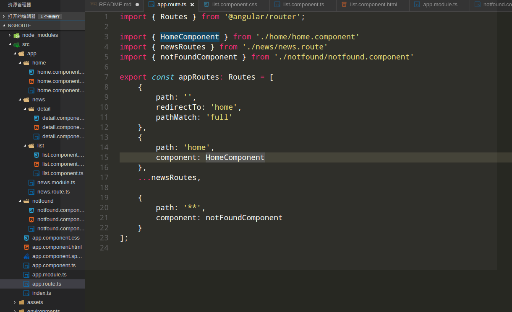
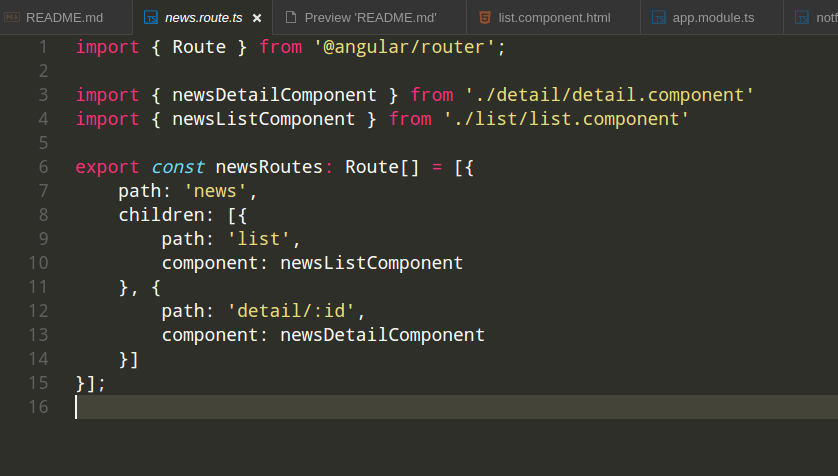
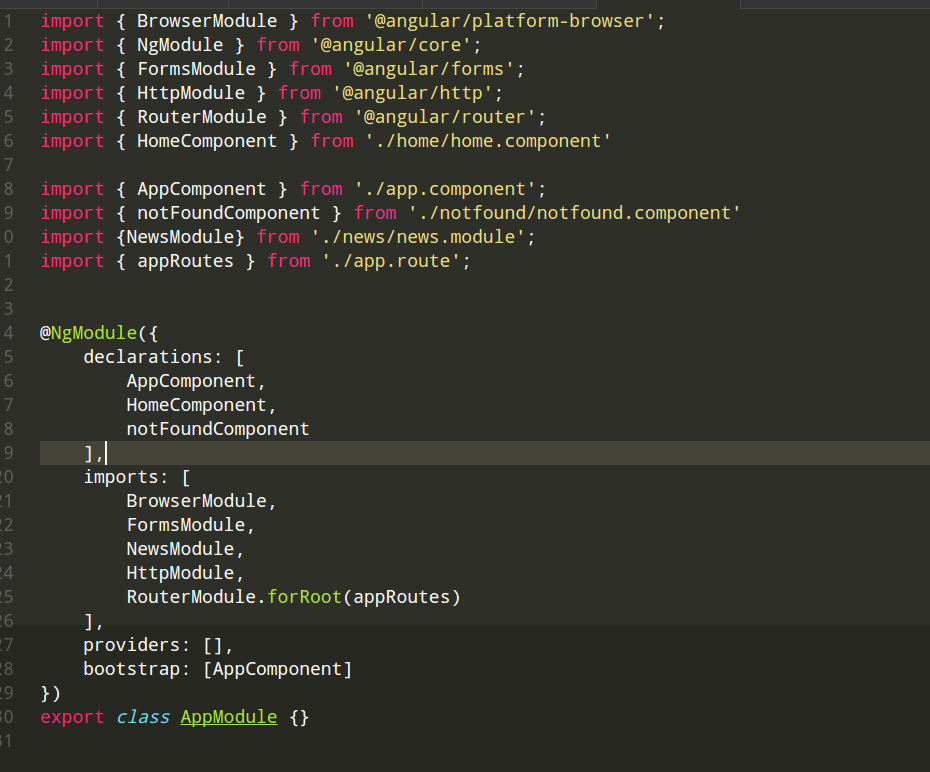

### 探索angular2中的路由


路由，应用于页面间的跳转和导航，如果你是一个后端开发人员或是有过React，BackBone框架的使用经验应该会清楚路由的作用。在单页面开发中，页面间的跳转是不经过服务器的。
当这个单页应用的页面比较多、业务比较复杂时，页面之间的跳转、数据传递、状态保存等都是一件非常麻烦的事情。

那么，在实际开发中我们往往是借助成熟的路由模块，由它帮我们接管我们应用中的路由系统。在angular2中，框架为我们提供ngRouter模块，我们只需要定义一个个的路径和与之对应的组件
，其它的交给ngRouter模块就可以了。

好了，废话不多说了，接下来在这篇文章中我会以一个demo详细介绍Angular2路由的使用、通过路由设置实现验证和授权，以及子模块和子路由模块的异步加载之类的问题。

### <span id="jump">相关概念</span>
下面是一些路由器中的关键词汇及其含义：

|路由器部件|含义|
|       ---      |---|
|Router（路由器）|为激活的URL显示应用组件。管理从一个组件到另一个组件的导航|
|RouterModule（路由器模块）|一个独立的Angular模块，用于提供所需的服务提供商，以及用来在应用视图之间进行导航的指令。|
|Routes（路由数组）|定义了一个路由数组，每一个都会把一个URL路径映射到一个组件。|
|Route（路由）|定义路由器该如何根据URL模式（pattern）来导航到组件。大多数路由都由路径和组件类构成|
|RouterOutlet（路由插座）|该指令（<router-outlet>）用来标记出路由器该在哪里显示视图|
|RouterLink（路由链接）|该指令用来把一个可点击的HTML元素绑定到路由。 点击带有绑定到字符串或链接参数数组的routerLink指令的A标签就会触发一次导航。|
|RouterLinkActive（活动路由链接）|当HTML元素上或元素内的routerLink变为激活或非激活状态时，该指令为这个HTML元素添加或移除CSS类。|
|ActivatedRoute（激活的路由）|为每个路由组件提供提供的一个服务，它包含特定于路由的信息，比如路由参数、静态数据、解析数据、全局查询参数和全局碎片（fragment）。|
|RouterState（路由器状态）|路由器的当前状态包含了一棵由程序中激活的路由构成的树。它包含一些用于遍历路由树的快捷方法。|
|链接参数数组|这个数组会被路由器解释成一个路由操作指南。我们可以把一个RouterLink绑定到该数组，或者把它作为参数传给Router.navigate方法。|
|路由组件|一个带有RouterOutlet的Angular组件，它根据路由器的导航来显示相应的视图。|

### 搭建开发环境

我使用的是angular官方提供的开发工具[angular-cli](https://github.com/angular/angular-cli)。它能帮我们快速搭建一个ng2的项目。
搭建完成后进入到src/app目录新建文件夹，我的如下:


当然你也可以直接git clone我的仓库。省去一步步创建文件的麻烦。

### 设置base

在我们开发的根目录下的index.html文件的head标签内添加以下内容:
```
<base href="/">

```
这是告诉我们的应用的根路径所在。

### 配置相关路由规则

设置完根目录后就开始书写我们的路由配置文件了，先贴一下我的配置文件，一般文件都命名为xxx.route.ts。





在这份配置文件内我们从router模块中引入了[routes模块](#jump)，它其实就是一个路由列表类型Route[],请看第二份配置文件。而Route是Angular路由框架定义的一个接口。
一个基础的路由包括2个属性:path和component,分别是这个路由对应的URL和组件。

一般而言，通过这两个属性，就可以完成路由导航了。其他属性还包括redirectTo（重定向）,pathMatch(属性值有full和prefix两种方式)。


### 使路由配置生效
配置文件完成后，这时我们害无法看到效果，还需要告诉angular如何使用这份配置文件，一般而言都是在根模块下引入这份配置文件,不出意外也就是app.module.ts文件中来设置，具体配置请参考如下:



在这个文件中我们先引入了Angular2的路由模块RouterModule，然后在下面的imports里面，通过RouterModule.forRoot(routes)用路由模块引用之前定义的路由设置。

> RouterModule类的forRoot静态方法和提供的配置，被添加到imports数组中，提供该模块的路由信息。需要注意的是这个方法只适用在根模块中，永远不要在特性路由模块中调用RouterModule.forRoot！特性路由模块中调用RouterModule.forChild！！！

`可能在开发中会有一些不太一样的配置，不过他们的实质都是一样，只是某些代码写在了不同 的地方，例如：`


```typescript

import { NgModule }     from '@angular/core';
import { RouterModule } from '@angular/router';
@NgModule({
  imports: [
    RouterModule.forRoot([
       {
        path: '',
        redirectTo: 'home',
        pathMatch: 'full'
       },
       {
            path: 'home',
            component: HomeComponent
       },
        ...newsRoutes,

       {
            path: '**',
            component: notFoundComponent
       }
    ],
  exports: [
    RouterModule
  ]
})
export class AppRoutingModule {}

```

然后在app.module.ts的imports直接引入就可以了。

`再大型项目中，为了提高应用首次加载速度，我们可能会用到惰性加载模块的方式优化我们的应用，angular的路由模块为我们提供了这方面的功能，我们
只需要在路由配置文件使用如下方式就可以就可以实现模块的惰性加载了`

```
{ path: 'news', loadChildren: 'app/news/news.module#NewsModule' }

```

在这里我们使用了route里的loadChildren属性，值为字符串形式，该字符串同时标记出了模块文件和模块类，两者用#分隔开。


### 还差一步

到了这儿，我们的路由配置文件基本已经完工了，唯一还需要做的就是设置我们的组件的载入点，也就是告诉angular应该在哪里载入我们预先定义的组件
，在angular1.X我们也有过类似的代码那就是ng-view指令。不过在angular2里面换了一个指令叫做router-outlet。一般而言，我们会把他写在我们
的app.component.html文件中。


好啦，如果你完成了以上步骤，这个时候可以启动应用在浏览器看到效果了。


### 导航

以上部分其实只是完成了一个基本的基于url导航的应用，在实际开发中，我们还会碰到各种各样的页面间的跳转需求。

#### 超链接

通常，我们会使用超链接完成页面见的跳转，而不是在浏览器里直接输入地址。 angular2里要完成这一步我们需要改造a标签，这和react-router很相似。如下:

```
<a routerLink="./home" routerLinkActive="active">这是一Home链接</a>

```

以上就是一个基本的超链接导航。其中routerLink就是路由地址。 routerLinkActive就是这个链接激活时为他添加的一个"active"的class，也包括子路由时同样会被激活。


到了这儿，可能会有人说如果我们想要通过routerLink传递参数怎么办呢，不急哈！，我们慢慢来。


传递参数的两种形式：
1. 作为路由地址的一部分。如"./news/detail/2"，其中2就是要传递的参数。

2. 作为url后面的查询字符串。如："./news/list?page=0&size=20",其中page=0&size=20就是要传递的参数。这种形式常见于分页或是搜索。


针对第一种是这样解决的：
```
<a [routerLink]="['/news/detail',news.id]" routerLinkActive="active">
```

那么当这个参数传递出去后，我们又是如何获取的呢？

在我们对应的组件内是这样拿到参数值的:
```
let newsId = this.route.snapshot.params['id'];
```
这段代码的意思就是获取当前路由快照的参数id。
你们可以参考我写的detail组件代码，很清晰易懂的。


第二种方式的传值和取值与第一种类似，我就不详细说了，直接贴代码吧。
```	
<a [routerLink]="['/news/list']" [queryParams]="{size: 20, page: 1}">

let size = this.route.snapshot.queryParams['size'];
let page = this.route.snapshot.queryParams['page'];
```

#### 代码内导航

除了在我们的html里使用超链接的方式完成导航外，还会在组件里书写相关导航代码，那么在这种情形下如何做呢？？
其实也很简单，和angular1.x类似，要完成代码内的路由跳转只需要这样做：
```
this.router.navigate(['/home'])
```

以上就是angular中关于路由的简单用例，当然router模块里还有更多高级用法，如用户身份进行路由拦截。在我研究完成后会在下一篇博客里再讲。
另外值得一提的是在这个例子中虽然我们讲的是angular2的路由，但是页涵盖了一些其他知识，比如angular的根模块和特性模块，指令的定义和使用，以及组件等知识。
这些东西其实贯穿angular框架始终，所以如果其中有些不太懂的话，还需要再多了解了解。
跟多实现细节请参考我写的demo，地址是[ng-route](https://github.com/lyfnsmile/ng-route)
### reference

- [https://angular.cn/docs/ts/latest/guide/router.html](https://angular.cn/docs/ts/latest/guide/router.html)